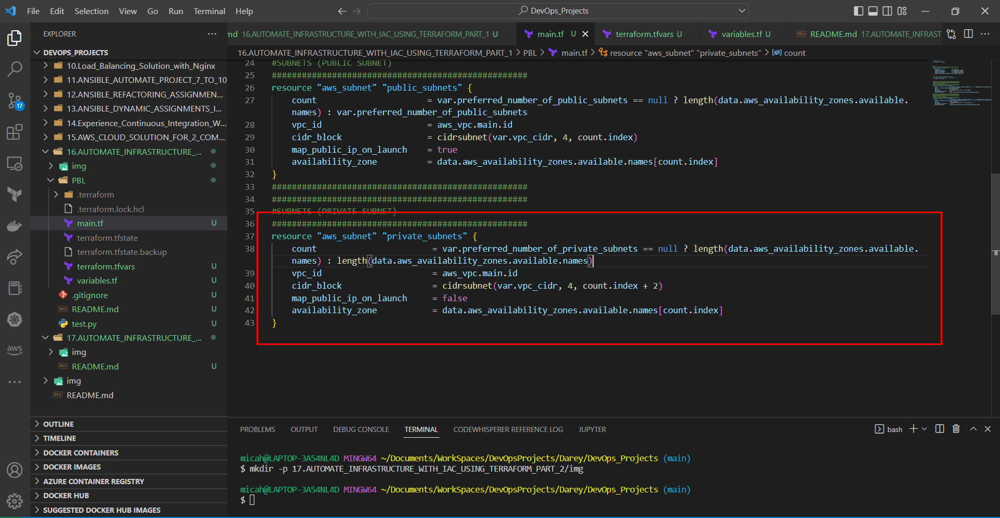
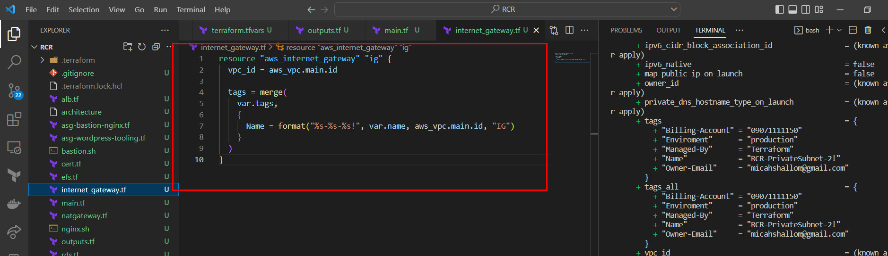
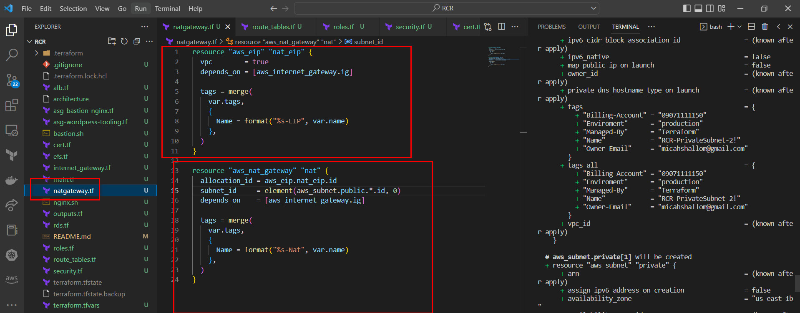
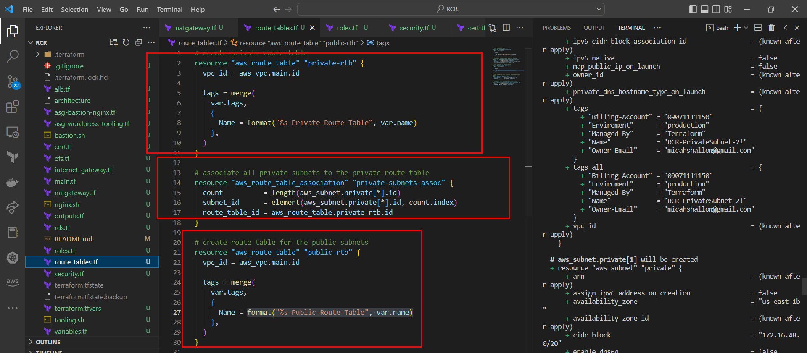
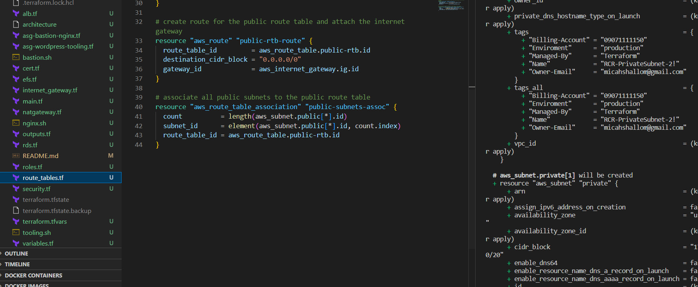
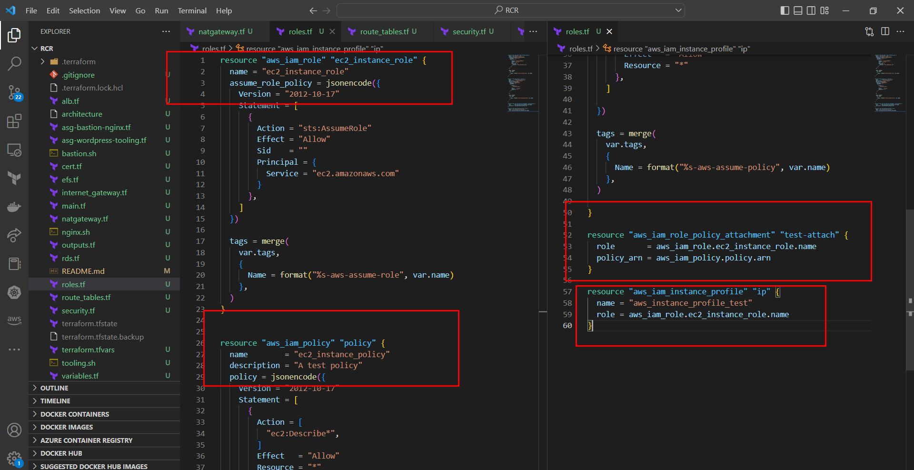

## FURTHER IMPLEMENTATION OF INFRASTRUCTURE AUTOMATION WITH IAC USING TERRAFORM
#
#
[Link To Code Implementation](https://github.com/Micah-Shallom/RCR-TERRAFORM-ARCHITECTURE.git)
#
#

## Understanding Basic Network Concepts
#
### IP Address: 
- An IP address is a unique address that identifies a device on the internet or a local network. IP stands for "Internet Protocol," which is the set of rules governing the format of data sent via the internet or local network.

### Subnets
- A subnet, or subnetwork, is a segmented piece of a larger network. More specifically, subnets are a logical partition of an IP network into multiple, smaller network segments. 

### CIDR Notation
- CIDR notation (Classless Inter-Domain Routing) is an alternate method of representing a subnet mask. It is simply a count of the
number of network bits (bits that are set to 1) in the subnet mask.

### IP Routing
- IP routing is the process of sending packets from a host on one network to another host on a different remote network

### Internet Gateways
- An internet gateway is a horizontally scaled, redundant, and highly available VPC component that allows communication between your VPC and the internet
  
### NAT
- A NAT gateway is a Network Address Translation (NAT) service. You can use a NAT gateway so that instances in a private subnet can connect to services outside your VPC but external services cannot initiate a connection with those instances.
  

### Create 4 private subnets keeping in mind following principles:
- Make sure you use variables or length() function to determine the number of AZs
- Use variables and cidrsubnet() function to allocate vpc_cidr for subnets
- Keep variables and resources in separate files for better code structure and readability
- Tags all the resources you have created so far. Explore how to use format() and count functions to automatically tag subnets with its respective number.
  

### Internet Gateways & format() function
Create an Internet Gateway in a separate Terraform file internet_gateway.tf. This serves as an entry point for internet into the virtual private network

###NAT Gateways
- Create 1 NAT Gateways and 1 Elastic IP (EIP) addresses

- Now use similar approach to create the NAT Gateways in a new file called natgateway.tf.

Note: We need to create an Elastic IP for the NAT Gateway, and you can see the use of depends_on to indicate that the Internet Gateway resource must be available before this should be created. Although Terraform does a good job to manage dependencies, but in some cases, it is good to be explicit.

### AWS ROUTES
- Create a file called route_tables.tf and use it to create routes for both public and private subnets, create the below resources. Ensure they are properly tagged.

- aws_route_table
- aws_route
- aws_route_table_association

### AWS Identity and Access Management
### IaM and Roles
We want to pass an IAM role our EC2 instances to give them access to some specific resources, so we need to do the following:

Create AssumeRole
Assume Role uses Security Token Service (STS) API that returns a set of temporary security credentials that you can use to access AWS resources that you might not normally have access to. These temporary credentials consist of an access key ID, a secret access key, and a security token. Typically, you use AssumeRole within your account or for cross-account access.

Add the following code to a new file named `roles.tf`

